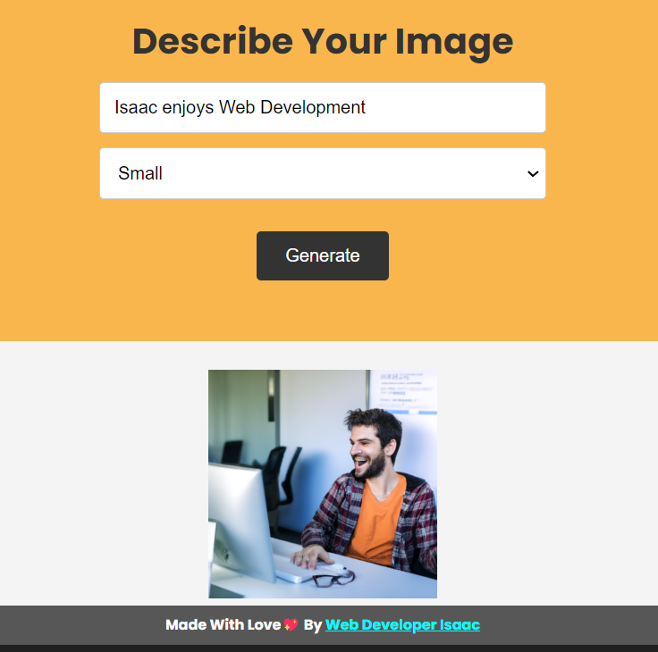

# AI Text to Image Converter

This Web Application uses the OPENAI api to Generate
images based from the user input text and Displays on the 
front end of the Application

@webdeveloperisaac

OpenAI is an Advanced AI that uses complex AI techniques 
and Advanced ML concepts and Large Datsets to be able to you know 
to best possibly generate the images we want 

## Deployment Take a Look :
https://ai-based-text-to-image-generator.onrender.com/ 

### Feel Free to add Responsiveness and Give pull request was too busy to make it mobile responsive so it's just load on Desktop

Seems Simply Magical if you ask me here is a screenshot
me and Sir Isaac Newton : ) lol 

 
 

this one i can confirm is Mee : ))
### Authors

- [@Isaac](https://www.github.com/webdeveloperisaac)

